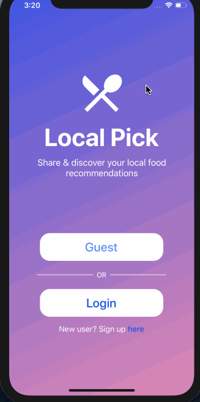

# Local Pick
## Demo Video

<hr/>
A local food directory and social service created to help users find local recommendations. Users can create an account or remain as a guest user and browse categories which hold locally recommended establishments. Users can view notes posted by other users, and post their own categories, recommendations and notes to the application.

## Getting Started
1. Fork and clone from this repository onto your local machine
```
$ git clone https://github.com/[user_name]/local-pick.git
```
2. In your terminal, navigate into the cloned directory and install the required dependencies
```
$ yarn install
```
3. Create a database on Firebase using Firestore, and turn on E-mail password authentication.

4. Install Xcode in order to view mobile simulator (Apple users)

5. Install Expo CLI in order to test application

```
$ yarn install expo-cli --global

```
6. Start expo in local terminal in order to begin testing and simulation
```
$ expo start

```
7. Local Pick is ready to go!

## Built With
* Front-End
  * [JavaScript](https://www.ecma-international.org/publications/standards/Ecma-262.htm)
  * [React.js](https://reactjs.org/)
  * [React Native](https://facebook.github.io/react-native/)
* Back-End
  * [Firebase](https://firebase.google.com/)
* Testing
  * [Expo](https://expo.io/)
  * [Xcode](https://developer.apple.com/xcode/)

## Contributing
Please feel free to fork from this repository, make pull requests and help improve the game by sending suggestions to dev.jamestang.gmail.com

## License
This project is licensed under the MIT License - see the below for details.
[MIT License](https://opensource.org/licenses/mit-license.php)

[](https://opensource.org/licenses/mit-license.php)